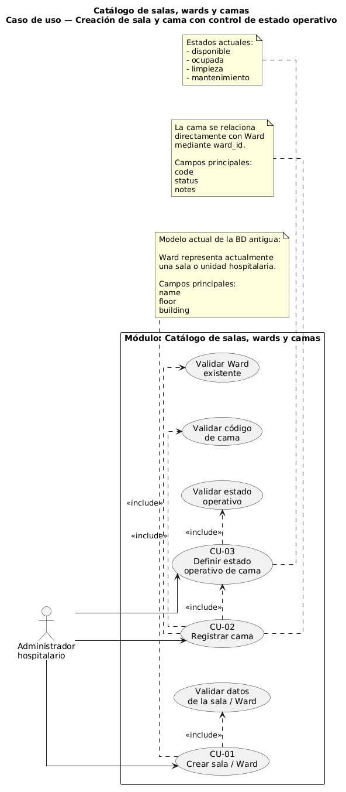
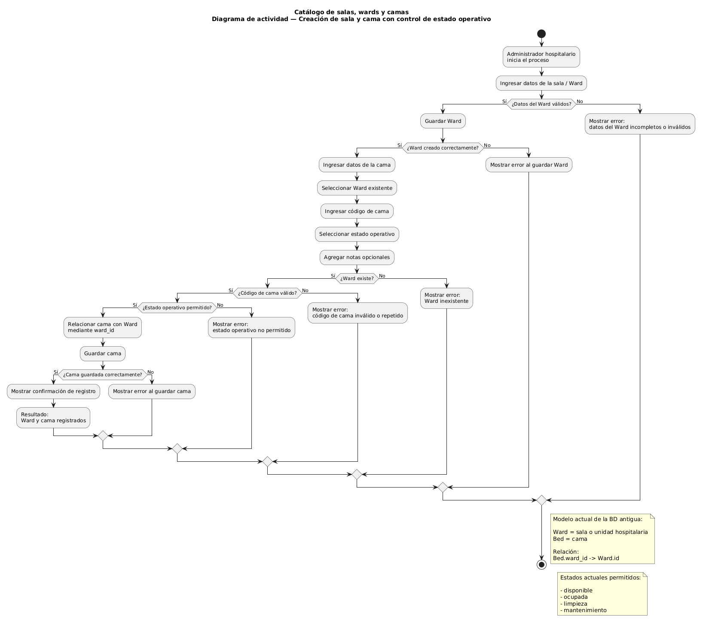
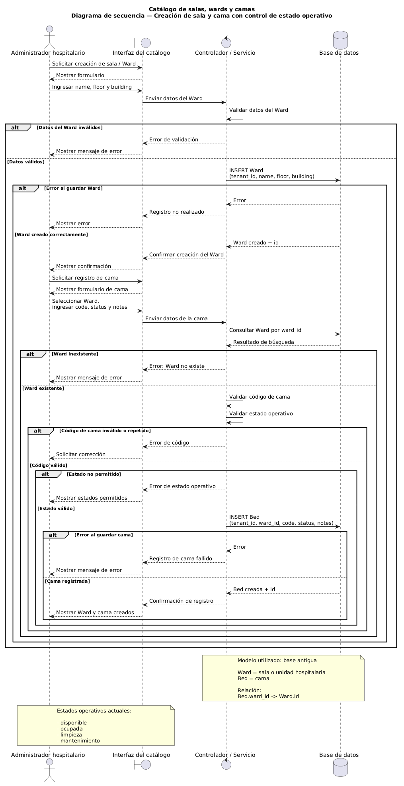

# Diagramas UML — Catálogo de salas, wards y camas

## Información general

| Dato | Valor |
|---|---|
| Estudiante | Madelin Jazmín Cerón Molina |
| GitHub | `MadelinCeron` |
| Módulo | Catálogo de salas, wards y camas |
| Proceso asignado | Creación de sala y cama con control de estado operativo |
| Repositorio | `uml-catalogo-salas-wards-camas` |
| Rama de trabajo | `tarea-diagramas-uml` |

---

## 1. Descripción

Este repositorio contiene la evidencia correspondiente a la actividad individual de Diagramas UML del módulo **Catálogo de salas, wards y camas**.

El proceso modelado es:

> **Creación de sala y cama con control de estado operativo.**

Los tres diagramas representan el mismo proceso desde diferentes perspectivas:

- Diagrama de casos de uso.
- Diagrama de actividad.
- Diagrama de secuencia.

Para el desarrollo de la actividad se toma como referencia la estructura antigua actualmente existente en la base de datos del proyecto.

---

## 2. Modelo utilizado

La base de datos actual utiliza la siguiente relación:

```text
Ward / sala o unidad hospitalaria
└── Bed / cama
```

Actualmente `Ward` representa una sala o unidad hospitalaria.

### Ward

Campos considerados:

- `id`
- `tenant_id`
- `name`
- `floor`
- `building`

### Bed

Campos considerados:

- `id`
- `tenant_id`
- `ward_id`
- `code`
- `status`
- `notes`

Cada cama pertenece directamente a un Ward mediante:

```text
ward_id
```

Los estados operativos actuales son:

- `disponible`
- `ocupada`
- `limpieza`
- `mantenimiento`

---

## 3. Proceso modelado

El proceso comienza cuando el administrador hospitalario registra una sala o unidad hospitalaria.

En la estructura actual, esta operación corresponde a la creación de un `Ward`.

Posteriormente se registra una cama asociándola al Ward creado mediante `ward_id`.

Durante el registro se realizan validaciones relacionadas con:

- Datos obligatorios del Ward.
- Existencia del Ward.
- Código de la cama.
- Estado operativo.
- Registro correcto de la información.

El proceso finaliza cuando la sala/Ward y la cama quedan registradas correctamente o cuando el sistema informa una excepción que debe ser corregida.

---

## 4. Diagrama de casos de uso

El diagrama de casos de uso representa las acciones que puede realizar el administrador hospitalario durante el proceso.



Fuente editable:

`uml/casos-de-uso.puml`

### Casos principales

- Crear sala / Ward.
- Registrar cama.
- Definir estado operativo.
- Validar información del Ward.
- Validar existencia del Ward.
- Validar código de cama.
- Validar estado operativo.

---

## 5. Diagrama de actividad

El diagrama de actividad representa el flujo completo del proceso y las decisiones que pueden presentarse.



Fuente editable:

`uml/actividad.puml`

### Decisiones consideradas

- ¿Los datos del Ward son válidos?
- ¿El Ward fue creado correctamente?
- ¿El Ward seleccionado existe?
- ¿El código de cama es válido?
- ¿El estado operativo es permitido?
- ¿La cama fue registrada correctamente?

### Excepciones consideradas

- Datos incompletos o inválidos.
- Error al registrar el Ward.
- Ward inexistente.
- Código de cama inválido o repetido.
- Estado operativo no permitido.
- Error al registrar la cama.

---

## 6. Diagrama de secuencia

El diagrama de secuencia representa la comunicación entre los participantes del proceso.



Fuente editable:

`uml/secuencia.puml`

### Participantes

- Administrador hospitalario.
- Interfaz del catálogo.
- Controlador / Servicio.
- Base de datos.

El diagrama muestra los mensajes, validaciones y respuestas necesarias para registrar el Ward y posteriormente registrar una cama asociada.

---

## 7. Matriz de trazabilidad

| Requisito / acción | Caso de uso | Actividad | Secuencia |
|---|---|---|---|
| Crear sala o unidad hospitalaria | CU-01 Crear sala / Ward | Ingresar y validar datos del Ward | Enviar datos del Ward y realizar `INSERT Ward` |
| Validar datos de sala / Ward | Validar datos de sala / Ward | Decisión: ¿Datos del Ward válidos? | Validación interna en Controlador / Servicio |
| Registrar cama | CU-02 Registrar cama | Ingresar datos de la cama | Enviar información de la cama |
| Asociar cama con Ward | Validar Ward existente | Decisión: ¿Ward existe? | Consultar Ward mediante `ward_id` |
| Validar código de cama | Validar código de cama | Decisión: ¿Código válido? | Servicio valida código |
| Definir estado operativo | CU-03 Definir estado operativo | Seleccionar y validar estado | Servicio valida estado |
| Guardar cama | CU-02 Registrar cama | Guardar cama | `INSERT Bed` |
| Informar resultado | Resultado del proceso | Confirmación o mensaje de error | Respuesta del servicio a interfaz y administrador |

La matriz demuestra que los tres diagramas representan el mismo proceso y mantienen coherencia entre actores, acciones, validaciones y resultados.

---

## 8. Limitación actual de la base de datos

El nombre oficial del módulo es:

**Catálogo de salas, wards y camas.**

Sin embargo, la estructura antigua actualmente utilizada solamente diferencia:

```text
Ward
└── Bed
```

No existe actualmente una entidad independiente para representar una sala o habitación diferente de un Ward.

Por esta razón, para esta actividad se considera:

```text
Ward = sala o unidad hospitalaria
```

y no se agregan nuevas entidades a la base de datos.

---

## 9. Posibles mejoras futuras

La estructura deberá revisarse posteriormente con el equipo para determinar si es necesario diferenciar los conceptos de Ward, sala y cama.

Una posible estructura futura podría ser:

```text
Ward / unidad hospitalaria
└── Sala / habitación
    └── Bed / cama
```

Esta estructura es únicamente una propuesta para análisis posterior y no representa la base actualmente implementada.

También quedan pendientes aspectos como:

- Definir reglas definitivas para los códigos de camas.
- Determinar si wards y camas podrán eliminarse o solamente desactivarse.
- Definir transiciones válidas entre estados operativos.
- Definir permisos específicos por rol.
- Mejorar las validaciones de tenant.
- Coordinar los estados de camas con los módulos de admisión, traslado y alta.
- Definir el contrato API definitivo.

---

## 10. Datos utilizados

Todos los datos utilizados en los ejemplos y diagramas son ficticios.

No se utiliza información clínica identificable ni información real de pacientes.

---

## 11. Estructura del repositorio

```text
uml-catalogo-salas-wards-camas/
│
├── README.md
├── DECLARACION_IA.md
├── GUIA_DEFENSA.md
│
├── docs/
│
├── evidencias/
│
└── uml/
    ├── casos-de-uso.puml
    ├── actividad.puml
    ├── secuencia.puml
    │
    └── imagenes/
        ├── casos-de-uso.png
        ├── actividad.png
        └── secuencia.png
```

---

## 12. Validación

Para validar los artefactos se verificó:

- Que los tres diagramas representen el mismo proceso.
- Que los actores sean coherentes entre diagramas.
- Que las decisiones del diagrama de actividad correspondan con las validaciones del diagrama de secuencia.
- Que se representen excepciones y respuestas.
- Que las fuentes UML sean editables.
- Que los diagramas utilicen datos ficticios.
- Que el análisis se base en la estructura antigua actualmente disponible.

---

## 13. Conclusión

La actividad permitió representar mediante UML el proceso de creación de una sala o Ward y el registro de una cama con control de estado operativo.

La decisión más importante fue utilizar la estructura actualmente existente en la base de datos, donde `Ward` representa una sala o unidad hospitalaria y `Bed` se relaciona directamente mediante `ward_id`.

Los diagramas mantienen trazabilidad entre las acciones, decisiones, validaciones y respuestas del proceso.

La principal limitación identificada es que la base actual no diferencia entre Ward y sala o habitación. Este aspecto deberá analizarse posteriormente antes de realizar cambios estructurales en el sistema.